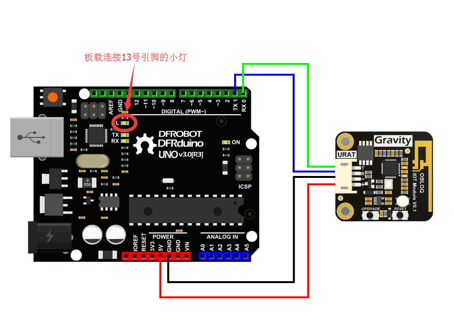

# OBLOQ简单教程

## 0. 一分钟简介

如果想将小台灯、小喇叭或其他用电器接入网络，对它们进行简单的远程监控和操作，OBLOQ一定是你的首选。OBLOQ配置十分简单，无需复杂的编程，15分钟就足够让这些小物件在互联网上拥有生命。


OBLOQ包括一系列物联网产品：

* 设备
* 主控板（如 Arduino UNO）
* OBLOQ模块
* OBLOQ-web

经过适当组合，在wifi环境下，设备通过OBLOQ模块就能连上互联网，按时发送设备状态或者接收远端控制指令。


形象点说，可以把OBLOQ模块看成一个“网卡”。

设备（包含主控）插上这个“网卡”，在Wifi环境下就能和互联网互通数据了。

可以这样理解，
$$
设备+主控板=智能设备
$$

$$
智能设备+OBLOQ模块=可联网的智能设备
$$

这些数据通过OBLOQ-web进行发送/转发，并可视化地储存在OBLOQ-web上。


##### （附）OBLOQ模块简介

功能：无线上网模块。能使设备能通过wifi连接上网，收发数据。正常工作时OBLOQ上绿色LED灯常亮。


接口：

|  名称  | 功能描述  |
| :--: | :---: |
|  TX  | 串口发送端 |
|  RX  | 串口接收端 |
| GND  | 电源负极  |
| VCC  | 电源正极  |


信号灯：

|  颜色  | 指示状态   |
| :--: | :----- |
|  红色  | 没有正常运行 |
|  白色  | 连上wifi |
|  蓝色  | 有新版固件  |
|  黄色  | 连接服务器中 |
|  绿色  | 正常工作   |


## 1. 在OBLOQ-web上创建项目

接下来通过一个简单的案例，我们了解如何使用OBLOQ。


### 创建项目设备：Button

登录[OBLOQ][http://obloq.dfrobot.com]官网，注册账号。进入工作间。新建一个名叫“Button”的设备。


为了稍后编程需要，记下这些关键字：

* OBLOQ-web账号：obloquser
* OBLOQ-web密码：20170307
* 设备名称：Button


## 2. 硬件搭建##

接着用杜邦线连接好OBLOQ系列硬件。这样一套硬件设备搭建完成后，只要给予wifi环境，并给主控板烧录适当的程序（固件），就能直接使用了。


**硬件清单**

| 名称                     | 数量   |
| ---------------------- | ---- |
| OBLOQ模块                | 1    |
| 主控板（如：Arduino UNO控制板*） | 1    |
| LED模块                  | 1    |
| 杜邦线                    | 若干   |

*关于主控板，这里挑选Arduino UNO作为例子讲解，其他兼容的主控板也可以使用。


**连线图示意**




## 3. 在主控板上烧录控制程序

完成硬件搭建后，为了能让这些模块和板子运作起来，需要给主控板写入运作逻辑的程序。具体代码如下：

修改样例代码中的测试wifi和测试OBLOQ-web账号，改成自己的wifi和账号即可：

```c++
iot.setup(Serial, "WIFI_SSID", "WIFI_PASSWD","IOT_USERNAME", "IOT_PASSWD");
```

**具体代码**

```c++
#include "Iot.h"
Iot iot;   
void * eventHandle(const char *data, uint16_t len)
{
   switch(atoi(data))              //将物联网发送字符串转换成数字
    {
      case 1:
        digitalWrite(13,HIGH);     //打开小灯
        break;
      case 2:
        digitalWrite(13,LOW);      //关闭小灯
        break;
      default:break;
    }
}

void setup(void)
{ 
  Serial.begin(38400);
  pinMode(13,OUTPUT);
  iot.setup(Serial, "DFSoftware", "dfrobotsoftware","test", "test");
  iot.subscribe("Button", eventHandle);   //Button是物联网设备名
  iot.start();
}
void loop(void)
{
  iot.loop();
}
```


烧录前确保UNO的Rx(0),Tx(1)引脚和OBLOQ断开连接，因为这里用的是硬件串口Rx(0),Tx(1)通信，不断开连接会造成程序烧录出错，高级教程通过使用软串口解决这个问题。保烧录完成后，连接OBLOQ模块的Rx,Tx，再按下主控板上的“Reset”按键重启主控板，等待模块联网即可。


## 4. 结果展示

现在看下这个项目的具体效果吧。

1. 保持硬件设备上电状态。OBLOQ模块正常工作状态下LED指示灯显示绿色常亮。
2. 登录OBLOQ-web工作间，查看设备Button是否存在，若不存在，创建一个Button设备。
3. 在Button设备消息里面发送数字“1”，板载连接在13号引脚的小灯会被点亮，发送数字“2”，小灯熄灭。


关于数据可视化的描述。


如果你并没有看到理想中的结果，检查一下是不是在下面的哪些步骤出了一些小问题：

* 程序中的wifi账号（SSID）、密码，物联网账号、密码、设备名称要保证书写的正确性
* 硬件连线要正确，尤其注意实际使用的引脚和程序是否能对应
* 当信号灯保持红色，蓝色或者黄色不变的时候，复位UNO开发板。


## 5. 总结
简单教程到此位置。

通过这个项目，我们了解了如何利用OBLOQ模块制作最基础的联网设备，并且使用此设备发送信息。

步骤总结：

1. 在OBLOQ-web上创建项目设备
2. 搭设硬件
3. 在发送端的主控板上烧录对应的固件
4. 展示项目效果，查看得到的设备数据


如果想了解进一步的OBLOQ使用方法，欢迎来到OBLOQ-web”智玩“板块。这里有更加有趣和详细的项目在等着你！